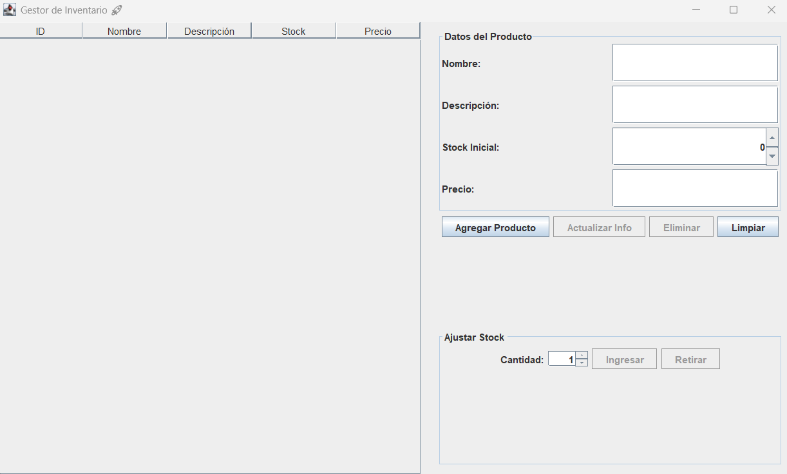

# 📦 Gestor de Inventario

Una aplicación de escritorio robusta y eficiente para gestionar el inventario de productos. Permite llevar un control del stock de manera visual, rápida y segura, ideal para mantener la organización de los artículos registrados.

## ✨ Características Principales
* **Gestión de Productos (CRUD):** Crear, leer, actualizar y eliminar artículos del sistema de forma intuitiva.
* **Control de Stock Dinámico:** Botones dedicados para ingresar o retirar cantidades específicas de stock, con validaciones para evitar saldos negativos.
* **Base de Datos Automática:** Toda la información se guarda de forma local. La base de datos se genera automáticamente al ejecutar el programa por primera vez, sin configuraciones de servidores externos.

## 🛠️ Tecnologías Utilizadas
* **Lenguaje:** Java 25
* **Interfaz Gráfica:** Java Swing
* **Base de Datos:** SQLite (mediante JDBC)
* **Gestor de Dependencias:** Maven

## 📥 Descarga

1. Ve a la sección de **[Releases](https://github.com/BrunoCandeago/Gestor-de-inventario/releases)** en la parte derecha de este repositorio.
2. Descarga el archivo `.jar` de la última versión publicada.
3. Asegúrate de tener **Java 25** (o superior) instalado en tu sistema.
4. Haz doble clic en el archivo descargado para ejecutarlo. *(Se creará automáticamente un archivo `inventario.db` en la misma carpeta para guardar tus datos).*

## 📂 Estructura del Proyecto
```text
Gestor-de-inventario/
├── src/
│   └── main/
│       └── java/               # Código fuente (Lógica, UI, Conexión DB)
├── pom.xml                     # Configuración de Maven y dependencias
├── preview.png                 # Captura de pantalla de la interfaz
└── README.md
```

## 📸 Vista Previa


## 👤 Autor
* **Bruno Candeago** - [@BrunoCandeago](https://github.com/BrunoCandeago)
* 💼 LinkedIn: [Bruno Candeago Caceres](https://www.linkedin.com/in/bruno-candeago-caceres/)
